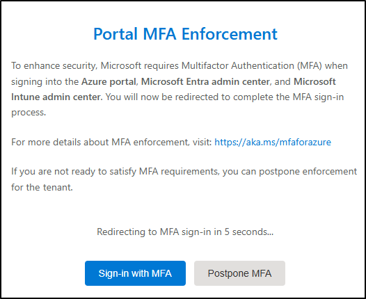

---
lab:
  title: 实验室设置 - 为管理准备环境
  module: Lab setup
---

## WWL 租户 - 使用条款

如果在讲师引导式培训过程中向你提供租户，请注意，提供租户旨在支持讲师引导式培训中的动手实验室。

租户不应共享或用于动手实验室以外的用途。 本课程使用的租户为试用租户，课程结束后无法使用或访问，不符合扩展条件。

租户不得转换为付费订阅。 在本课程中获得的租户仍然是 Microsoft Corporation 的财产，我们保留随时获取访问权限和收回的权利。

# 实验室设置 - 为管理准备环境

在此实验室中，你将为管理任务配置和准备环境。 你将启用所需的功能、配置权限以及准备核心服务进行管理。

**任务**：

1. 在 Microsoft Purview 门户中启用审核  
1. 启用设备加入  
1. 启用内部风险分析以及数据共享  
1. 设置用于实验室练习的用户密码  
1. 初始化 Microsoft Defender XDR

## 任务 1 - 在 Microsoft Purview 门户中启用审核

在此任务中，你将在 Microsoft Purview 门户中启用“审核”以监视门户活动。

1. 使用 **SC-401-CL1\admin** 帐户登录到客户端 1 VM (SC-401-CL1)，并使用 MOD 管理员帐户登录到 Microsoft 365。

1. 在 Microsoft Edge 中，导航到 Microsoft Purview 门户，`https://purview.microsoft.com`，然后登录。

1. 有关新的 Microsoft Purview 门户的消息将显示在屏幕上。 选择“**开始使用**”以访问新门户。

    

1. 从左侧边栏中选择“**解决方案**”，然后选择“**审核**”。

1. 在“**搜索**”页面，选择“**开始录制用户和管理活动**”栏以启用审核日志记录。

    

1. 选择此选项后，蓝色栏应从此页面消失。

<!----- PowerShell instructions

1. Open an elevated Terminal window by selecting the Windows button with the right mouse button and then select **Terminal (Admin)**.

1. Run the **Install Module** cmdlet in the terminal window to install the latest **Exchange Online PowerShell** module version:

    ```powershell
    Install-Module ExchangeOnlineManagement
    ```

1. Confirm the NuGet provider prompt by typing **Y** for Yes and press **Enter**.

1. Confirm the Untrusted repository security dialog with **Y** for Yes and press **Enter**.  This process may take some time to complete.

1. Run the **Set-ExecutionPolicy** cmdlet to change your execution policy and press **Enter**

    ```powershell
    Set-ExecutionPolicy -ExecutionPolicy RemoteSigned -Scope CurrentUser
    ```

1. Close the PowerShell window.

1. Open a regular (non-elevated) PowerShell window by right-clicking the Windows button and selecting **Terminal**.

1. Run the **Connect-ExchangeOnline** cmdlet to use the Exchange Online PowerShell module and connect to your tenant:

    ```powershell
    Connect-ExchangeOnline
    ```

1. When the **Sign in** window is displayed, sign in as `admin@WWLxZZZZZZ.onmicrosoft.com` (where ZZZZZZ is your unique tenant ID provided by your lab hosting provider). Admin's password should be provided by your lab hosting provider.

1. To check if Audit is enabled, run the **Get-AdminAuditLogConfig** cmdlet:

    ```powershell
    Get-AdminAuditLogConfig | FL UnifiedAuditLogIngestionEnabled
    ```

1. If _UnifiedAuditLogIngestionEnabled_ returns false, then Audit is disabled.

1. To enable the Audit log, run the **Set-AdminAuditLogConfig** cmdlet and set the **UnifiedAuditLogIngestionEnabled** to _true_:

    ```powershell
    Set-AdminAuditLogConfig -UnifiedAuditLogIngestionEnabled $true
    ```

1. To verify that Audit is enabled, run the **Get-AdminAuditLogConfig** cmdlet again:

    ```powershell
    Get-AdminAuditLogConfig | FL UnifiedAuditLogIngestionEnabled
    ```

1. _UnifiedAuditLogIngestionEnabled_ should return _true_ to let you know Audit is enabled.

-->

已在 Microsoft 365 中成功启用审核。

## 任务 2 - 启用设备加入

在本任务中，你将为组织启用设备加入。

1. 你仍应使用 **SC-401-CL1\admin** 帐户登录到客户端 1 VM (SC-401-CL1)，并以 MOD 管理员身份登录到 Microsoft 365。

1. 在 **Microsoft Edge** 中，导航到 **`https://purview.microsoft.com`** 以登录到 Microsoft Purview，然后从左侧边栏中选择“**设置**”。

1. 在左侧边栏中，展开“**设备加入**”，然后选择“**设备**”。

1. 在“**设备**”页上，选择“**启用设备加入**”，然后选择“**确定**”以启用设备加入。

1. 出现提示时，选择“**确定**”，以确认设备监视处于打开状态。

你现在已经启用了设备加入功能，可以开始加入设备以使用终结点 DLP 策略对其进行保护。 启用该功能的过程可能需要长达 30 分钟。

## 任务 3 - 启用内部风险分析以及数据共享

在此任务中，你将为内部风险管理启用分析及数据共享。

1. 你仍应使用 **SC-401-CL1\admin** 帐户登录到客户端 1 VM (SC-401-CL1)，并以 MOD 管理员身份登录到 Microsoft Purview。

1. 在 Microsoft Purview 中，导航到“**设置**” > “**内部风险管理**” > “**分析**”。

1. 将这些设置切换为“**开启**”：

   - **在租户级别显示洞察**

   - **在用户级别显示洞察**

1. 选择页面底部的“保存”  。

1. 在左侧导航窗格中，选择“**数据共享**”。

1. 在数据共享部分中，将“**共享用户风险详细信息与其他安全解决方案**”切换为“**开启**”。

1. 选择页面底部的“保存”  。

你已为内部风险管理启用分析及数据共享。

## 任务 4 - 设置用于实验室练习的用户密码

在此任务中，你将为实验室所需的用户帐户设置密码。

1. 你仍应使用 **SC-401-CL1\admin** 帐户登录到客户端 1 VM (SC-401-CL1)，并以 MOD 管理员身份登录到 Microsoft 365。

1. 打开 **Microsoft Edge** 并导航到**`https://admin.microsoft.com`**，然后以 MOD 管理员身份登录到 Microsoft 365 管理中心 `admin@WWLxZZZZZZ.onmicrosoft.com`（其中 ZZZZZZ 是实验室托管提供程序提供的唯一租户 ID）。

> [!note] **备注**：在某些租户中，登录时可能会看到门户 MFA 强制提示。 如果出现此提示：
> - 选择“**推迟 MFA**”以暂时延迟 MFA 设置。
>
>   
> - 选择“**确认推迟**”。
>
> - 选择“**继续登录而不使用 MFA**”访问管理中心。
>
> 这会推迟租户的 MFA 强制实施，并允许你继续执行实验室。

1. 在左侧导航窗格中，展开“**用户**”，然后选择“**活动用户**”。

1. 选中 **Joni Sherman**、**Lynne Robbins** 和 **Megan Bowen** 左侧的复选框。

   这些帐户将在实验室练习中使用。

   

1. 从顶部导航选择“**重置密码**”按钮，重置所有三个密码。

   

1. 在右侧的“**重置密码**”浮出控件页面，确保取消选择两个复选框。

   这将确保你可以为用于练习的三个用户选择密码，并且首次登录时无需重置这些密码。

1. 在“**密码**”字段中，输入可记住的密码以重置用户密码，供今后练习使用。

1. 在“**重置密码**”浮出控件页面底部，选择“**重置密码**”按钮。

1. 在“**密码已重置**”页面，应会看到已重置的三个用户帐户。 在此浮出控制页底部，选择“**关闭**”。

已成功重置实验室练习的密码。

## 任务 5 - 初始化 Microsoft Defender XDR

在此任务中，你将打开 Microsoft Defender 并等待 Microsoft Defender XDR 完成初始化。

1. 你仍应使用 **SC-401-CL1\admin** 帐户登录到客户端 1 VM (SC-401-CL1)，并以 MOD 管理员身份登录到 Microsoft Purview。

1. 在 **Microsoft Edge** 中，导航到**`https://security.microsoft.com/`**，打开 Microsoft Defender。

1. 在导航窗格中，选择“**调查和响应**” > “**事件和警报**” > “**事件**”。

> [!note] **备注**：Microsoft Defender XDR 初始化屏幕可能或可能不会显示，具体取决于实验室租户。 如果出现，可以在后台完成时继续执行其他任务。

1. 你将看到一条消息，指出，正在准备 Microsoft Defender XDR。 此过程自动运行，可能需要几分钟时间。

   

正在初始化 Microsoft Defender XDR。 完成设置后，可以继续执行其他任务。
