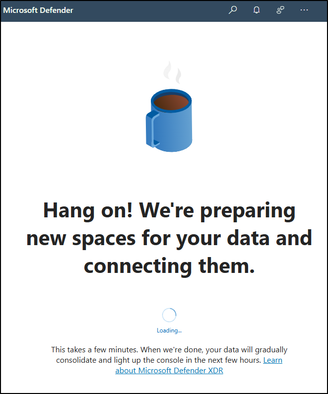

---
lab:
  title: 实验室设置 - 为管理准备环境
  module: Lab setup
---

## WWL 租户 - 使用条款

如果在讲师引导式培训过程中向你提供租户，请注意，提供租户旨在支持讲师引导式培训中的动手实验室。

租户不应共享或用于动手实验室以外的用途。 本课程使用的租户为试用租户，课程结束后无法使用或访问，不符合扩展条件。

租户不得转换为付费订阅。 在本课程中获得的租户仍然是 Microsoft Corporation 的财产，我们保留随时获取访问权限和收回的权利。

# 实验室设置 - 为管理准备环境

在此实验室中，你将为管理任务配置和准备环境。 你将激活必要的功能、设置管理权限，以及确保正确配置关键元素。

**任务**：

1. 在 Microsoft Purview 门户中启用审核
1. 设置用于实验室练习的用户密码
1. 启用设备加入
1. 启用内部风险分析

## 任务 1 - 在 Microsoft Purview 门户中启用审核

在此任务中，你将在 Microsoft Purview 门户中启用“审核”以监视门户活动。

1. 你仍应使用 **SC-401-CL1\admin** 帐户登录到客户端 1 VM (SC-401-CL1)，并使用 MOD 管理员帐户登录到 Microsoft 365。

1. 通过鼠标右键选择 Windows 按钮打开提升权限的终端窗口，然后选择**终端（管理员）**。

1. 在终端窗口中运行“**安装模块**”cmdlet，以安装最新的 **Exchange Online PowerShell** 模块版本：

    ```powershell
    Install-Module ExchangeOnlineManagement
    ```

1. 输入表示“是”的 **Y**，并按 **Enter**，确认 NuGet 提供程序提示。

1. 输入表示“是”的 Y 并按 Enter 键，以确认“不受信任的存储库安全”对话框 。  此过程可能需要一段时间才能完成。

1. 运行 **Set-ExecutionPolicy** cmdlet，以更改执行策略，然后按 **Enter**

    ```powershell
    Set-ExecutionPolicy -ExecutionPolicy RemoteSigned -Scope CurrentUser
    ```

1. 关闭 PowerShell 窗口。

1. 右键单击“Windows”按钮，然后选择“**终端(管理员)**”，打开常规（非提升的） PowerShell 窗口。

1. 输入 **Connect-ExchangeOnline** cmdlet，以使用 Exchange Online PowerShell 模块并连接到租户：

    ```powershell
    Connect-ExchangeOnline
    ```

1. 显示“登录”窗口时，以 `admin@WWLxZZZZZZ.onmicrosoft.com`（其中 ZZZZZZ 是实验室托管提供程序提供的唯一租户 ID）登录。 管理员的密码应由实验室托管提供程序提供。

1. 若要检查审核是否已启用，请运行 **Get-AdminAuditLogConfig** cmdlet：

    ```powershell
    Get-AdminAuditLogConfig | FL UnifiedAuditLogIngestionEnabled
    ```

1. 如果 _UnifiedAuditLogIngestionEnabled_ 返回“false”，则启用审核。

1. 要启用审核日志，请运行 **Set-AdminAuditLogConfig** cmdlet，并将 **UnifiedAuditLogIngestionEnabled** 设置为 _true_：

    ```powershell
    Set-AdminAuditLogConfig -UnifiedAuditLogIngestionEnabled $true
    ```

1. 要验证是否已启用审核，请再次运行 **Get-AdminAuditLogConfig** cmdlet：

    ```powershell
    Get-AdminAuditLogConfig | FL UnifiedAuditLogIngestionEnabled
    ```

1. _UnifiedAuditLogIngestionEnabled_ 应返回 _true_，告知已启用审核。

<!---

1. In Microsoft Edge, navigate to the Microsoft Purview portal, `https://purview.microsoft.com`, and log in.

1. A message about the new Microsoft Purview portal will appear on the screen. Select the option to agree with the terms of data flow disclosure and the privacy statement, then select **Try now**.

    

1. Select **Solutions** from the left sidebar, then select **Audit**.

1. On the **Search** page, select the **Start recording user and admin activity** bar to enable audit logging.

    

1. Once you select this option, the blue bar should disappear from this page.

-->

## 任务 2 - 设置用于实验室练习的用户密码

在此任务中，你将为实验室所需的用户帐户设置密码。

1. 使用 **SC-401-CL1\admin** 帐户登录到客户端 1 VM (SC-401-CL1)。 密码应由实验室托管提供程序提供。

1. 打开 **Microsoft Edge** 并导航到**`https://admin.microsoft.com`**，然后以 MOD 管理员身份登录到 Microsoft 365 管理中心 `admin@WWLxZZZZZZ.onmicrosoft.com`（其中 ZZZZZZ 是实验室托管提供程序提供的唯一租户 ID）。

1. 在左侧导航窗格中，展开“**用户**”，然后选择“**活动用户**”。

1. 选中 **Joni Sherman**、**Lynne Robbins** 和 **Megan Bowen** 左侧的复选框。

   这些帐户将在实验室练习中使用。

   

1. 从顶部导航选择“**重置密码**”按钮，重置所有三个密码。

   

1. 在右侧的“**重置密码**”浮出控件页面，确保取消选择两个复选框。

   这将确保你可以为用于练习的三个用户选择密码，并且首次登录时无需重置这些密码。

1. 在“**密码**”字段中，输入可记住的密码以重置用户密码，供今后练习使用。

1. 在“**重置密码**”浮出控件页面底部，选择“**重置密码**”按钮。

1. 在“**密码已重置**”页面，应会看到已重置的三个用户帐户。 在此浮出控制页底部，选择“**关闭**”。

已成功重置实验室练习的密码。

## 任务 3 - 启用设备加入

在本任务中，你将为组织启用设备加入。

1. 你仍应使用 **SC-401-CL1\admin** 帐户登录到客户端 1 VM (SC-401-CL1)，并以 MOD 管理员身份登录到 Microsoft 365。

1. 在 **Microsoft Edge** 中，导航到 **`https://purview.microsoft.com`** 以登录到 Microsoft Purview，然后从左侧边栏中选择“**设置**”。

1. 在左侧边栏中，展开“**设备加入**”，然后选择“**设备**”。

1. 在“**设备**”页上，选择“**启用设备加入**”，然后选择“**确定**”以启用设备加入。

1. 出现提示时，选择“**确定**”，以确认设备监视处于打开状态。

你现在已经启用了设备加入功能，可以开始加入设备以使用终结点 DLP 策略对其进行保护。 启用该功能的过程可能需要长达 30 分钟。

## 任务 4 - 启用内部风险分析

在此任务中，你将为内部风险管理启用分析。

1. 你仍应使用 **SC-401-CL1\admin** 帐户登录到客户端 1 VM (SC-401-CL1)，并以 MOD 管理员身份登录到 Microsoft Purview。

1. 在 Microsoft Purview 中，导航到“**设置**” > “**内部风险管理**” > “**分析**”。

1. 将 **Analytics** 切换为“**打开**”，然后选择“**保存**”。

已为内部风险管理启用分析。

## 任务 5 - 初始化 Microsoft Defender XDR

在此任务中，你将打开 Microsoft Defender 并等待 Microsoft Defender XDR 完成初始化。

1. 你仍应使用 **SC-401-CL1\admin** 帐户登录到客户端 1 VM (SC-401-CL1)，并以 MOD 管理员身份登录到 Microsoft Purview。

1. 在 **Microsoft Edge** 中，导航到**`https://security.microsoft.com/`**，打开 Microsoft Defender。

1. 在导航窗格中，选择“**调查和响应**” > “**事件和警报**” > “**事件**”。

1. 你将看到一条消息，指出，正在准备 Microsoft Defender XDR。 此过程自动运行，可能需要几分钟时间。

   

正在初始化 Microsoft Defender XDR。 完成设置后，可以继续执行其他任务。
