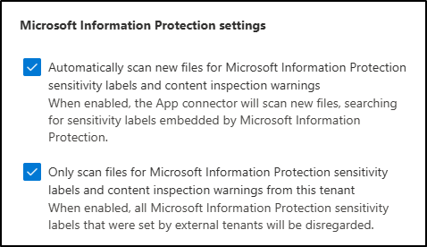
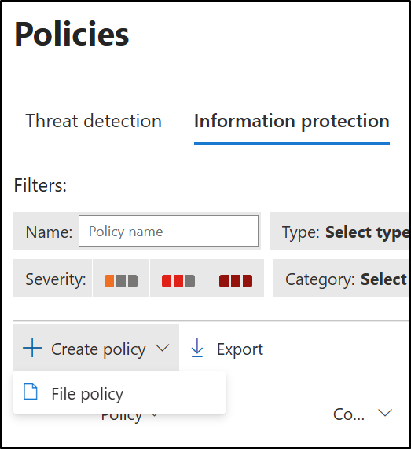
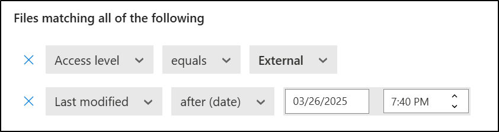

---
lab:
  title: 练习 3 - 创建并管理敏感度标签
  module: Module 1 - Implement Information Protection
---

# 实验室 1 - 练习 3 - 创建和管理敏感度标签

Contoso Ltd. 信息安全管理员 Joni Sherman 正在推出敏感度标签策略，以帮助跨部门保护敏感数据。 作为这项工作的一部分，她配置手动和自动标记、子标签和加密选项，包括支持双重密钥加密 (DKE)，并与 Microsoft Defender for Cloud Apps 集成。

**任务**：

1. 启用对敏感度标签的支持
1. 创建敏感度标签
1. 创建子标签
1. 发布敏感度标签
1. 配置自动标记
1. 为高度机密内容创建和发布 DKE 标签
1. 在 Defender for Cloud Apps 中 启用 Microsoft Purview 集成
1. 创建文件策略以自动标记外部共享文件

## 任务 1 - 启用对敏感度标签的支持

在此任务中，你将为敏感度标签启用共同创作，这也为 SharePoint 和 OneDrive 中的文件启用敏感度标签。

1. 你仍应使用 **SC-401-CL1\admin** 帐户登录到客户端 1 VM (SC-401-CL1)，并以 Joni Sherman 的身份登录到 Microsoft Purview。

1. 打开 **Microsoft Edge**，然后导航到 `https://purview.microsoft.com`。

1. 在左侧导航中，选择“**设置**” > “**信息保护**”。

1. 在“**信息保护设置**”页上，确保你处于“**为使用敏感度标签的文件启用共同创作**”选项卡上。

1. 选中“**为使用敏感度标签的文件打开共同创作**”复选框。

1. 在屏幕底部，选择“**应用**”。

你已为 SharePoint 和 OneDrive 中的文件成功启用对敏感度标签的支持。

## 任务 2 - 创建敏感度标签

在此任务中，你将为内部内容创建父敏感度标签。 此标签包含基本设置，并充当部门特定的子标签的父标签。

1. 你仍然应该会使用 **SC-401-CL1\admin** 帐户登录到客户端 1 VM (SC-401-CL1)。

1. 在“Microsoft Edge”中，导航到 。

1. 在 Microsoft Purview 门户中的左侧边栏中选择“**解决方案**”，然后选择“**信息保护**”。

1. 在“**Microsoft 信息保护**”页上的左侧边栏中，选择“**敏感度标签**”。

1. 在“**敏感度标签**”页上，选择“**+ 创建标签**”。

1. 此时会启动“**新建敏感度标签**”配置。 在“**提供此标签的基本详细信息**”上输入：

    - **名称**：`Internal`
    - **显示名称**：`Internal`
    - **** 面向用户的说明：`Internal sensitivity label.`
    - **** 面向管理员的说明：`Internal sensitivity label for Contoso.`

1. 选择**下一步**。

1. 在“**定义此标签的范围**”页上，选择“**文件**”和“**电子邮件**”。 如果已选中“**会议**”复选框，请确保将其取消选中。

1. 选择**下一步**。

1. 在“选择带标签项的保护设置”页面上，选择“下一步” 。

1. 在“自动标记文件和电子邮件”页面上，选择“下一步” 。

1. 在“定义组和网站的保护设置”页面上，选择“下一步” 。

1. 在“查看设置并完成”页面上，选择“创建标签” 。

1. 在“你的敏感度标签已创建”页上，选择“现在不创建策略”，然后选择“完成”。************

你已创建敏感度标签供内部使用。 此标签将充当不同部门中使用的更具体的子标签的父标签。

## 任务 3 - 创建子标签

有了基础标签后，你将为与 HR 相关的文档创建子标签。 此子标签包含保护设置和可见内容标记，以支持 HR 部门的内部数据处理做法。

1. 在“**敏感度标签**”页上，找到新创建的“**内部**”敏感度标签。 选择其旁边的垂直省略号 (**...**)，然后从下拉列表中选择“**+ 创建子标签**”。

    

1. 此时会启动“新建敏感度标签”向导。 在“**提供此标签的基本详细信息**”页中，输入：

   - **名称**：`Employee data (HR)`
   - **显示名称**：`Employee data (HR)`
   - **** 面向用户的说明：`This HR label is the default label for all specified documents in the HR Department.`
   - **** 面向管理员的说明：`This label is created in consultation with Ms. Jones (Head of HR department). Contact her if you need to change the label settings.`

1. 选择**下一步**。

1. 在“**定义此标签的范围**”页上，选择“**文件**”和“**电子邮件**”。 如果已选中“**会议**”复选框，请确保将其取消选中。

1. 选择**下一步**。

1. 在“**选择带标签项的保护设置**”页上，选择“**控制访问**”和“**应用内容标记**”选项，然后选择“**下一步**”。

1. 在“**访问控制**”页上，选择“**配置访问控制设置**”。

1. 使用以下选项配置加密设置：

   - **立即分配权限或让用户自行决定?** ：立即分配权限
   - **用户对内容的访问权限过期**：从不
   - **允许脱机访问**：仅几天
   - **用户在多少天内可以脱机访问内容**:15
   - 选择“**分配权限**”链接。 在“**分配权限**”浮出控件面板上，选择“**+ 添加任何经过身份验证的用户**”，然后选择“**保存**”以应用此设置。

1. 在“访问控制”页上，选择“下一步”********。

1. 在“**内容标记**”页上，选择切换以启用“**内容标记**”。

1. 对于以下每种标记类型，请选中该复选框，然后选择编辑图标以输入文本：

   |标记类型|文本|
   |:---|:---|
   |添加水印|`INTERNAL USE ONLY`|
   |添加标题|`Internal Document`|
   |添加页脚|`Contoso Confidential`|

1. 选择**下一步**。

1. 在“自动标记文件和电子邮件”页面上，选择“下一步” 。

1. 在“定义组和网站的保护设置”页面上，选择“下一步” 。

1. 在“查看设置并完成”页面上，选择“创建标签” 。

1. 在“你的敏感度标签已创建”页上，选择“现在不创建策略”，然后选择“完成”。************

你已创建一个子标签，用于将加密和内容标记应用于 HR 文档。 此标签有助于确保 HR 数据仅可供经过身份验证的用户访问，并且可以通过视觉标记进行标识。

## 任务 4 - 发布敏感度标签

现在，你将发布内部敏感度标签和人力资源部敏感度标签，以便人力资源部的用户可以在其人力资源文档中使用发布的敏感度标签。

1. 你仍应使用 **SC-401-cl1\admin** 帐户登录到客户端 1 VM (SC-401-CL1)，并且应以 **Joni Sherman** 的身份登录到 Microsoft Purview。

1. 在 Microsoft Edge 中，Microsoft Purview 门户选项卡应该仍处于打开状态。 如果没有，请导航到“**`https://purview.microsoft.com`**” > “**解决方案**” > “**信息保护**” > “**敏感度标签**”。

1. 在“**敏感度标签**”页上，选择“**发布标签**”。

1. 此时会启动“发布敏感度标签”配置。

1. 在“选择要发布的敏感度标签”页面上，选择“选择要发布的敏感度标签”链接 。

1. 在“**用于发布的敏感度标签**”浮出控件面板上，选择“**内部**”和“**内部/员工数据 (HR)**”复选框，然后选择浮出控件页底部的“**添加**”。

1. 返回“**选择要发布的敏感度标签**”页面上，选择“**下一步**”。

1. 在“分配管理单元”**** 页面上，选择“下一步”****

1. 在“发布到用户和组”页面上，选择“下一步” 。

1. 在“策略设置”页面上，选择“下一步” 。

1. 在“文档的默认设置”中，选择“下一步” 。

1. 在“电子邮件的默认设置”中，选择“下一步” 。

1. 在“会议和日历活动的默认设置”中，选择“下一步” 。

1. 在“**Fabric 和 Power BI 内容的默认设置**”页上，选择“**下一步**”。

1. 在“**为策略命名**”页上输入：

   - **名称**：`Internal HR employee data`

   - **** 输入有关敏感度标签策略的说明：`This HR label is to be applied to internal HR employee data.`

1. 选择**下一步**。

1. 在“查看并完成”页面上，选择“提交” 。

1. 在“**已创建新策略**”页上，选择“**完成**”，以完成标签策略的发布。

你成功发布了内部和人力资源敏感度标签。 请注意，最多可能需要 24 小时才能将更改复制到所有用户和服务。

## 任务 5 - 配置自动标记

在此任务中，你将为财务数据创建敏感度标签，并将其配置为自动应用于包含特定财务标识符的内容，例如信用卡号和银行路由信息。

1. 你仍应使用 **SC-401-cl1\admin** 帐户登录到客户端 1 VM (SC-401-CL1)。

1. 在 Microsoft Edge 中，导航到  ，并以 Joni Sherman 的身份登录到 Microsoft Purview 门户  。

1. 在 Microsoft Purview 门户中，选择“**解决方案**” > “**信息保护**” > “**敏感度标签**”。

1. 在“**敏感度标签**”页上，找到“**内部**”敏感度标签。 选择垂直省略号 (**...**)，然后从下拉列表中选择“**+ 创建子标签**”。

1. 在“**提供此标签的基本详细信息**”页中，输入：

   |详细信息|文本|
   |---|---|
   |**Name**|`Financial Data`|
   |**显示名称**|`Financial Data`|
   |**用户说明**|`This content contains financial data that must be labeled and protected.`|
   |**管理员说明**|`This label is used for content that includes sensitive financial identifiers.`|

1. 选择**下一步**。

1. 在“**定义此标签的范围**”页上，选择“**文件**”和“**电子邮件**”。 如果已选中“**会议**”复选框，请确保将其取消选中。

1. 选择**下一步**。

1. 在“选择带标签项的保护设置”页面上，选择“下一步” 。

1. 在“自动标记文件和电子邮件”页面上，将“自动标记文件和电子邮件”设置为“已启用” 。

1. 在“**检测符合这些条件的内容**”部分，选择“**+ 添加条件**” > “**内容包含**”。

1. 在“**内容包含**”部分下，选择“**添加**” > “**敏感信息类型**”。

1. 在“**敏感信息类型**”浮出控件页中，搜索并选择以下敏感信息类型：

   - `Credit Card Number`
   - `ABA Routing Number`
   - `SWIFT Code`

1. 选择 **添加** 。

1. 在“自动标记文件和电子邮件”**** 页面上，选择“下一步”****。

1. 在“定义组和网站的保护设置”页面上，选择“下一步” 。

1. 在“查看设置并完成”页面上，选择“创建标签” 。

1. 在“**创建敏感度标签**”页上，选择“**自动将标签应用于敏感内容**”，然后选择“**完成**”。

1. 在“**创建自动标记策略**”浮出控件页上，选择“**查看策略**”。

1. 在“**为自动标记策略命名**”页上，保留默认值，然后选择“**下一步**”。

1. 在“**选择要自动应用的标签**”页上，查看以确保选择“_内部/财务数据_”标签，然后选择“**下一步**”。

1. 在“分配管理单元”**** 页面上，选择“下一步”****。

1. 在“**选择要应用标签的位置**”页上，选择以下选项：

   - Exchange 电子邮件
   - SharePoint 站点
   - OneDrive 帐户

1. 选择**下一步**。

1. 在“**设置通用或高级规则**”页上，保留默认选择“**通用规则**”，然后选择“**下一步**”。

1. 在“**定义所有位置中的内容规则**”页上，展开“_财务数据规则_”的规则，以确保定义预期的规则，然后选择“**下一步**”。

1. 在“**电子邮件的其他默认设置**”页上，选择“**下一步**”。

1. 在“**决定是现在测试策略还是稍后测试策略**”页上，选择“**在模拟模式下运行策略**”，然后选中“**在模拟中未修改达 7 天时自动启用策略**”的复选框。

1. 选择**下一步**。

1. 在“查看并完成”页上，选择“创建策略” 。

1. 在“你的自动标记策略已创建”页上，选择“完成”。********

你已成功为财务数据创建了敏感度标签，并配置了自动标记策略来检测和标记包含敏感财务信息的内容。

## 任务 6 - 为机密内容创建和发布 DKE 标签

在此任务中，你将在内部标签下创建一个子标签。 此子标签将使用双重密钥加密 (DKE) 和动态水印来保护仅由法务访问的敏感内容。 你还将配置一个标签策略，该策略需要降级标签的理由。

1. 你仍应使用 **SC-401-cl1\admin** 帐户登录到客户端 1 VM (SC-401-CL1)。

1. 在 Microsoft Edge 中，导航到  ，并以 Joni Sherman 的身份登录到 Microsoft Purview 门户  。

1. 在 Microsoft Purview 门户中，选择“**解决方案**” > “**信息保护**” > “**敏感度标签**”。

1. 在“**敏感度标签**”页上，找到“**内部**”敏感度标签。 选择垂直省略号 (**...**)，然后从下拉列表中选择“**+ 创建子标签**”。

1. 在“**提供此标签的基本详细信息**”页中，输入：

   |详细信息|文本|
   |---|---|
   |**Name**|`Highly Confidential - Legal`|
   |**显示名称**|`Highly Confidential - Legal`|
   |**用户说明**|`Use this label for highly sensitive content that must be encrypted using Double Key Encryption.`|
   |**管理员说明**|`Label configured with DKE and dynamic watermarking for highly sensitive content.`|

1. 选择**下一步**。

1. 在“**定义此标签的范围**”页上，选择“**文件**”和“**电子邮件**”。 如果已选中“**会议**”复选框，请确保将其取消选中。

1. 在“**为所选择的项类型选择保护设置**”上，选中“**控制访问**”复选框，然后选择“**下一步**”。

1. 在“**访问控制**”页上，选择“**配置访问控制设置**”。

1. 使用以下选项配置加密设置：

   - **立即分配权限或让用户自行决定?** ：立即分配权限

   - **用户对内容的访问权限过期**：应用标签后的天数

   - **应用标签后的几天内，访问权限将过期**：5

   - **允许脱机访问**：从不

   - 选择“**分配权限**”链接。 在“**分配权限**”浮出控件面板中，选择“**+ 添加用户或组**”。

   - 在“**添加用户或组**”浮出控件页上，搜索并选择 `Legal Team` 和 `Joni Sherman`，然后“**添加**”。

   - 在“**分配权限**”页中，选择“**保存**”。

1. 返回“**访问控制**”页上，选中“**使用动态水印**”复选框，然后选择“**自定义文本 (可选)**”。

1. 在“**将自定义文本添加到水印（可选）**”页上，输入`Confidential`，然后选择“**UPN**”和“**时间戳**”的链接。

1. 选择页面底部的“保存”  。

1. 返回“**访问控制**”页，选中“**使用双重密钥加密**”复选框，然后输入 `https://testingdke1.azurewebsites.net/Test` 作为双重密钥加密服务的 URL。

1. 选择**下一步**。

1. 在“自动标记文件和电子邮件”页面上，选择“下一步” 。

1. 在“定义组和网站的保护设置”页面上，选择“下一步” 。

1. 在“查看设置并完成”页面上，选择“创建标签” 。

1. 在“**已创建敏感度标签**”页上，选择“**将标签发布到用户应用**”，然后选择“**完成**”。

1. 在“**发布标签**”浮出控件页上，选择“**创建新标签策略**”。

1. 在“**选择要发布的敏感度标签**”页上，选择“**选择要发布的敏感度标签**”并添加“**高度机密**”标签和“**高度机密 - 法务**”子标签，然后选择“**添加**”。

1. 选择**下一步**。

1. 在“分配管理单元”**** 页面上，选择“下一步”****。

1. 在“**发布到用户和组**”页上，保留默认选项，然后选择“**下一步**”。

1. 在“**策略设置**”页上，选择“**用户必须提供删除标签或降低其分类的理由**”复选框，然后选择“**下一步**”。

1. 在“文档的默认设置”页上，选择“下一步” 。

1. 在“电子邮件的默认设置”页上，选择“下一步” 。

1. 在“会议和日历活动的默认设置”页上，选择“下一步” 。

1. 在“**Fabric 和 Power BI 内容的默认设置**”页上，选择“**下一步**”。

1. 在“**为策略命名**”页上输入：

   - **名称**：`Highly Confidential - Legal`

   - **说明**：`Enables manual use of the DKE label for highly confidential content accessible by Legal.`

1. 选择**下一步**。

1. 在“查看并完成”页面上，选择“提交” 。

1. 在“新策略已创建”页上，选择“完成”********。

已成功使用双重密钥加密和动态水印创建和发布子标签。 此标签为高度机密的内容提供强保护，并强制实施受限的访问和分类更改的理由。

## 任务 7 - 在 Defender for Cloud Apps 中启用 Microsoft Purview 集成

在此任务中，你将在 Microsoft Defender for Cloud Apps 中启用 Microsoft Purview 集成。 这允许 Defender 扫描新文件以查找 Microsoft Purview 敏感度标签，基于这些标签检查内容并监视文件，以便应用文件策略。

1. 仍应使用 **SC-401-CL1\admin** 登录到客户端 1 VM (SC-401-CL1)，并且应以 Joni Sherman 的身份登录。

1. 打开 **Microsoft Edge**，然后导航到 `https://security.microsoft.com`，以转到 **Microsoft Defender**。

1. 在左侧导航中，选择“**设置**”，然后选择“**云应用**”。

1. 在左窗格中的“**信息保护**”部分下，选择“**Microsoft 信息保护**”。

1. 在“**Microsoft 信息保护**”页上，选中页面上可用的两个复选框。

    

   - **自动扫描 Microsoft 信息保护敏感度标签和内容检查警告”的新文件**

      使 Defender for Cloud Apps 能够自动扫描来自 Microsoft Purview 的敏感度标签和内容检查警告的新文件或修改的文件。

   - **仅扫描此租户的 Microsoft 信息保护敏感度标签和内容检查警告的文件**

      将扫描限制为在自己的组织中创建的标签和警告。 将忽略外部租户应用的标签。

1. 选择“保存”以应用设置。

1. 在左窗格中的“**信息保护**”部分下，选择“**文件**”。

1. 在“**文件**”页面上，选择“**启用文件监视**”。

1. 选择“保存”以应用设置。

你已启用 Defender for Cloud Apps 来扫描文件以查找敏感度标签并监视文件，以便文件策略可以评估和应用治理操作。

## 任务 8 - 创建文件策略以自动标记外部共享文件

启用标签扫描后，你将创建一个文件策略，用于将“**Highly Confidential -Project-Falcon**敏感性标签”应用于组织外部共享的 Mark 8 Project 文件夹中的文件。 此策略被归类为 DLP，因为它可防止敏感数据意外泄露。

1. 在 **Microsoft Defender** 中，导航到“**云应用**” > “**策略**” > “**策略管理**”。

1. 选择“**信息保护**”选项卡，然后选择“**创建策略**” > “**文件策略**”。

    

1. 在“**创建文件策略**”页上，配置：

   - **策略名称**：`Auto-label external sharing for Project Falcon files`

   - **策略严重性**：**高**

   - **类别**：**DLP**

   - **应用于**：**所选文件夹**

      - 选择“**添加文件夹**”，然后在“**文件名**”字段中搜索`Project`。

      - 选中 **Project Team Notebook**和 **Project Team** SharePoint 文件夹的复选框。

      - 选择“**完成**”以关闭“**选择文件夹**”窗口。

   - 在“**符合以下所有部分的文件**”中：

      - 对于第一个筛选器，请将下拉列表配置为：**访问级别等于外部**

      - 对于第二个筛选器，请将下拉列表配置为：“**上次修改后（日期）**”并使用今天的日期

          

   - 在**治理操作**下，展开 **Microsoft OneDrive for Business**：

      - 选中“**应用敏感度标签**”的复选框

      - 从下拉列表中选择“**Highly Confidential-Project - Falcon**”

   - 对 **Microsoft Office SharePoint Online** 重复相同的流程

      - 选中“**应用敏感度标签**”的复选框

      - 从下拉列表中选择“**Highly Confidential-Project - Falcon**”

1. 选择“**创建**”，以完成创建文件策略。

你已创建一个文件策略，该策略将高度机密敏感度标签应用于 位于 SharePoint 和 OneDrive 的 Mark 8 Project 文件夹中外部共享的文件。 检测到匹配文件后，Defender for Cloud Apps 将自动应用标签。
