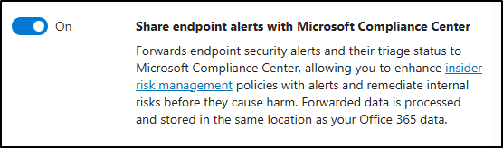

---
lab:
  title: 练习 1 - 实现内部风险管理
  module: Module 3 - Implement Insider Risk Management
---

## WWL 租户 - 使用条款

如果在讲师引导式培训过程中向你提供租户，请注意，提供租户旨在支持讲师引导式培训中的动手实验室。

租户不应共享或用于动手实验室以外的用途。 本课程使用的租户为试用租户，课程结束后无法使用或访问，不符合扩展条件。

租户不得转换为付费订阅。 在本课程中获得的租户仍然是 Microsoft Corporation 的财产，我们保留随时获取访问权限和收回的权利。

# 实验室 3 - 练习 1 - 实现内部风险管理

你是 Contoso Ltd. 的信息安全管理员 Joni Sherman。你的角色涉及确保法规合规性和保护组织内的敏感信息。 最近，Contoso Ltd. 注意到了可能会暴露敏感数据的异常浏览活动。 为了主动应对此内部风险，你将实施 Microsoft Purview 内部风险管理，重点关注有效识别、分析和响应潜在内部威胁。

**任务**：

1. 分配内部风险管理权限
1. 配置内部风险指示器
1. 创建内部风险策略
1. 自定义数据泄漏策略
1. 启用 Microsoft Defender for Endpoint 与内部风险管理集成
1. 启用指示器并配置优先级用户
1. 为优先级用户的安全策略违规创建策略
1. 创建通知模板

## 任务 1 - 分配内部风险管理权限

在此任务中，你将分配 Joni Sherman 内部风险管理角色，以便她可以访问和管理 purview Microsoft 中的内部风险功能。

1. 使用 **SC-401-cl1\admin** 帐户登录到客户端 1 VM (SC-401-CL1)。

1. 在 Microsoft Edge 中，导航到 **`https://purview.microsoft.com`**，以 MOD 管理员身份 `admin@WWLxZZZZZZ.onmicrosoft.com`（其中 ZZZZZZ 是实验室托管提供者提供的唯一租户 ID）登录到 Microsoft Purview 门户。 管理员的密码应由实验室托管提供程序提供。

1. 选择“**设置**” > “**角色和范围**” > “**角色组**”。

1. 在“Microsoft Purview 解决方案的角色组”页上，选择“内部风险管理” 。

1. 在右侧的“**内部风险管理**”浮出面板中，选择“**编辑**” 。

1. 在“编辑角色组的成员”页上，选择“+ 选择用户” 。

1. 在“**选择用户**”浮出面板上，搜索 `Joni` 并选择 **Joni Sherman** 的复选框。

1. 选择面板底部的“**选择**”按钮。

1. 在“编辑角色组的成员”页上，选择“下一步” 。

1. 在“查看角色组并完成”页上，选择“保存” 。

1. 成功将 Joni 添加到角色组后，请在“**已成功更新角色组**”页上选择“**完成**”。

1. 选择窗口右上角的“MA”图标，然后选择“**退出登录**”，以退出登录“**Mod 管理员**”帐户。

你已向 Joni 分配了在 Microsoft Purview 门户中使用内部风险管理工作所需的权限。

## 任务 2 - 配置内部风险指示器

在创建内部风险策略之前，你将打开检测所需的指示器。 这些指标定义系统将查找的风险活动类型。

1. 在 **Microsoft Edge** 中，导航到 **`https://purview.microsoft.com`** 并以 `JoniS@WWLxZZZZZZ.onmicrosoft.com` 的身份（其中 ZZZZZZ 是实验室托管提供者提供的唯一租户 ID）登录到 Microsoft Purview 门户。

1. 选择“**设置**” > “**内部风险管理**”。

1. 为“**策略指示器**”选择左侧的选项卡。

1. 在“**策略指示器**”页上，展开并选择“**选择全部**”，以启用这些类别中的所有指示器：

   - Office 指示器
   - 累积外泄检测

1. 选择页面底部的“保存”  。

你已启用关键策略指示器，以便系统可以检测敏感操作，例如文件外泄或有风险的 Office 活动。

## 任务 3 - 创建内部风险策略

在此任务中，你将创建一个数据泄漏快速策略，以自动检测和响应与数据外泄相关的有风险的用户行为。 快速策略使用内置模板和默认阈值来简化设置。

1. 在 Microsoft Purview 中，选择“**解决方案**” > “**内部风险管理**” > “**策略**”。

1. 在“**策略**”页上，选择“**创建策略**”，然后选择“**快速策略**”。

1. 在“**创建快速策略**”浮出控件上，选择“**数据泄漏 **”下的**“入门**”。

1. 查看用于创建快速数据泄漏策略的设置，然后选择“**创建策略**”。

1. 在“**正在创建数据泄漏策略**”页上，选中复选框：

   - 当策略未解决警告时向我发送电子邮件
   - 生成新的高严重性警报时向我发送电子邮件

     然后选择“**更新通知设置**”。

1. 在“**正在创建数据泄漏策略**”页面底部，选择“**完成**”。

你已创建一个快速策略，用于使用默认设置检测潜在的数据泄漏。 接下来，你将对其进行自定义以解决配置警告。

## 任务 4 - 自定义数据泄漏策略

某些内部风险策略需要其他指示器才能正常运行。 在此任务中，你将修改策略以启用序列指示器并将策略置于正常状态。

在“**内部风险管理**”的“**策略**”页上，你会注意到数据泄露策略有一项建议。

1. 选择刚刚创建的“**数据泄漏快速策略**”。

1. 查看策略的浮出控件页中的建议。 你有一条警告，指出“**未选择序列触发器所需的指示器**”。 要解决此警告，请选择“**编辑策略**”。

1. 在“**选择策略模板**”页上，选择“**下一步**”。

1. 在“**为策略命名**”页上，选择“**下一步**”。

1. 在“**选择用户、组和自适应范围**”页上，选择“**下一步**”。

1. 在“**排除用户和组(可选) (预览)**”页上，选择“**下一步**”。

1. 在“**决定是否设置内容优先级**”页上，选择“**下一步**”

1. 在“**为此策略选择触发事件**”页上，查看“**选择将触发此策略的序列**”，并查看以下信息：**某些序列要求在“设置”中启用特定指示器，然后才能选择以下序列。**

1. 选择“**打开指示器**”的选项，为此策略启用必要的序列指示器。

1. 数据泄漏主要是数据外泄内部风险策略。 在对话框中启用序列指示器，选择“**选择全部**”以打开所有必需的“**外泄指示器**”，然后选择“**保存**”。

1. 在“**选择此策略触发事件**”页上，选择“**下一步**”。

1. 在“**选择触发事件的阈值**”页上，选择“**下一步**”。

1. 在“**指示器**”页上，选择“**下一步**”。

1. 在“**检测选项**”上，选择“**下一步**”。

1. 在“**选择指示器的阈值类型**”页上，选择“**下一步**”。

   此策略使用内置的触发事件和指示器。 仅当 Microsoft defender for Endpoint 检测到防御逃避或不需要的软件等威胁时，它才会开始评估用户活动。

1. 在“查看设置并完成”页上，选择“提交” 。

1. 在“**策略已创建**”页上，选择“**完成**”。

1. 返回“**策略**”页，策略现在应具有“**正常**”状态。

内部风险策略现在正常运行，可以基于序列触发器和启用的指示器检测风险活动。

## 任务 5 - 启用 Microsoft Defender for Endpoint 与内部风险管理的集成

在此任务中，你将在 Microsoft Defender for Endpoint 与 Microsoft Purview 之间启用集成，以便在内部风险策略中使用安全警报。

1. 在 Microsoft Edge 中，转到 `https://security.microsoft.com` 以导航到 Microsoft Defender。

1. 在导航窗格中，选择“**设置**” > “**终结点**” > “**高级功能**”。

1. 向下滚动并选择切换到“**打开**”，以“**使用 Microsoft 合规中心共享终结点**”。

   

1. 在屏幕底部，选择“**保存首选项**”。

已成功启用 Defender for Endpoint，以便与 Microsoft Purview 共享警报。

## 任务 6 - 启用指示器并配置优先级用户

在此任务中，你将配置策略指示器，并创建可在内部风险策略中使用的优先级用户组。

1. 在“Microsoft Edge”中，导航到 。

1. 选择“**设置**” > “**内部风险管理**”。

1. 为“**策略指示器**”选择左侧的选项卡。

1. 在“**策略指示器**”页上，展开并选择“**选择全部**”，以启用这些类别中的所有指示器：

   - Microsoft Defender for Endpoint 指示器（预览版）
   - 有风险的浏览指示器（预览版）

1. 选择页面底部的“保存”  。

1. 选择“**优先级用户组**”选项卡，然后选择“**+ 创建优先级用户组**”。

1. 在“**命名并描述优先用户组**”页上，输入：

   - **名称**：`Finance team`
   - **说明**：`Team members who manage financial operations, budgeting, and payroll systems.`

1. 选择**下一步**。

1. 在“**成员**”页上，选择“**+添加成员**”。

1. 在“**成员**”浮出控件中，搜索并选择：

   - `Lynne Robbins`
   - `Debra Berger`
   - `Megan Bowen`

1. 选择“**添加**”，将这三个成员添加到财务团队优先级组。

1. 选择**下一步**。

1. 在“**选择谁可以查看涉及此优先组中的用户的数据**”上，选择“**+ 选择用户和角色组**”。

1. 在浮出控件中，选中“**内部风险管理**”的复选框，然后选择“**添加**”。

1. 选择**下一步**。

1. **查看**并**提交**设置，然后在创建优先级用户组后选择“**完成**”。

你已配置策略指示器，并创建了用于监视高风险用户的优先级组。

## 任务 7 - 为优先级用户的安全策略违规创建策略

在此任务中，你将创建一个内部风险策略，用于检测优先级用户针对风险活动的 Defender for Endpoint 警报。

1. 在 Microsoft Purview 中，选择“**解决方案**” > “**内部风险管理**” > “**策略**”。

1. 在“**策略**”页上，选择“**创建策略**”，然后选择“**自定义策略**”。

1. 在“**选择策略模板**”页上，选择“**优先级用户的安全策略违规(预览版)**”，然后选择“下一步”。

1. 在“**为策略命名**”页上输入：

   - **名称**：`Security policy violations - Priority users`
   - **说明**：`Detects Defender for Endpoint alerts for risky activity by priority users, such as malware or disabled protections.`

1. 选择**下一步**。

1. 在“**选择用户、组和自适应范围**”页上，选择“**添加或编辑优先级用户组**”。

1. 在“**选择优先级用户组**”浮出控件上，选中“**财务团队组**”复选框，然后选择“添加”。

1. 选择**下一步**。

1. 在“**决定是否确定内容的优先级**”页上，选择“**下一步**”。

1. 在“**选择此策略的触发事件**”页上，选择“**下一步**”。

1. 在“**指示器**”页上，选择“**下一步**”。

1. 在“**选择指示器的阈值类型**”页上，保留并选择默认的“**应用 Microsoft 提供的阈值**”选项，然后选择“**下一步**”。

1. 在“查看设置并完成”页上，选择“提交” 。

1. 在“已创建策略”页上，选择“完成” 。

你已创建自定义内部风险策略，该策略使用 Defender for Endpoint 信号来检测优先级用户的风险活动。

## 任务 8 - 创建通知模板

在此任务中，你将在 Microsoft Purview 中创建通知模板，以在触发内部风险警报时通知用户。

1. 在 Microsoft Purview 中，选择“**解决方案**” > “**内部风险管理**” > “**通知模板**”。

1. 在“**通知模板**”页上，选择“**+ 创建通知模板**”。

1. 在右侧的“**创建新的通知模板**”弹出面板中填写必要的信息。

    - **面板名称**：`Security Violation Alert`
    - **发件人**：`Joni Sherman`
    - **主题**：`Unusual activity detected - please review`
    - **消息正文**：

        ````html
        <!DOCTYPE html>
        <html>
        <body>
        <h2>Security Alert</h2>
        <p>We've detected activity from your account that might violate our organization's security policies. This could be due to malware, disabled protections, or other risky behavior.</p>
        <p>Please review your recent actions and ensure your device security settings are up to date. If you believe this alert was generated in error, contact the IT Security team for assistance.</p>
        <p>To avoid future issues, refer to the <a href="https://contoso.com/security-guidelines">Contoso Security Guidelines</a>.</p>
        <p>Thank you,</p>
        <p><em>Compliance and Security Team</em></p>
        </body>
        </html>
        ````

1. 选择**创建**。

1. 返回到“**通知模板**”页，你将看到刚刚创建的“**安全违规警报**”模板。

你已创建一个通知模板，内部风险管理可用于通知用户安全策略违规。
