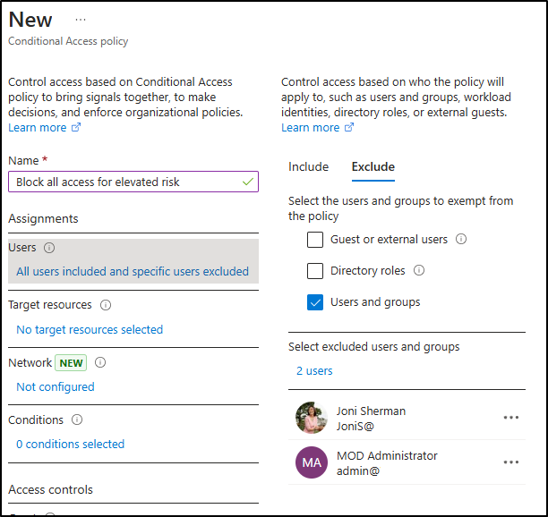
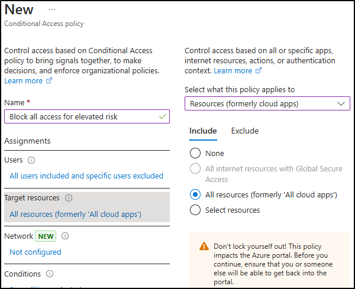
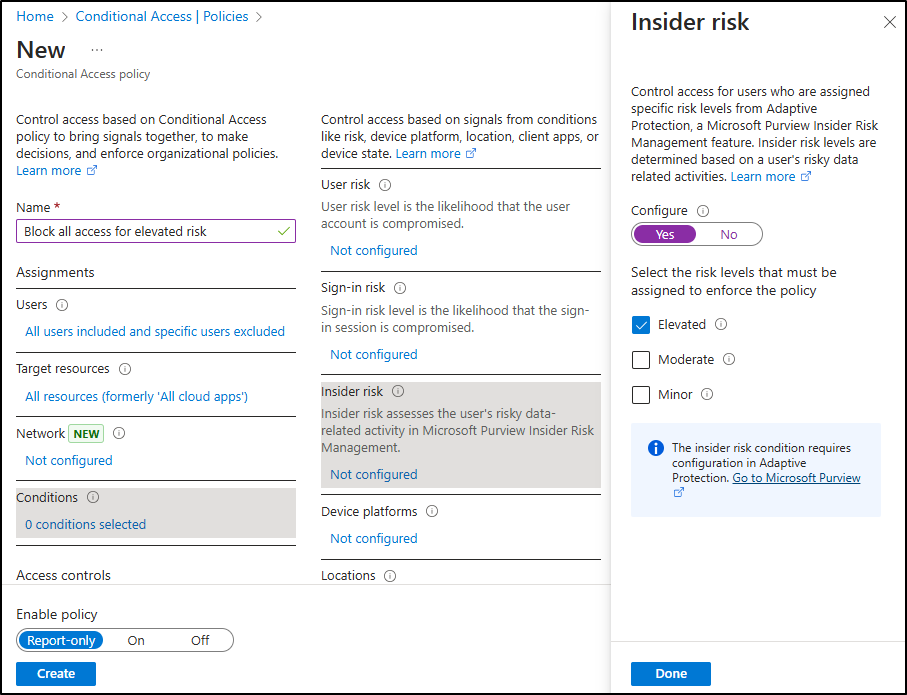
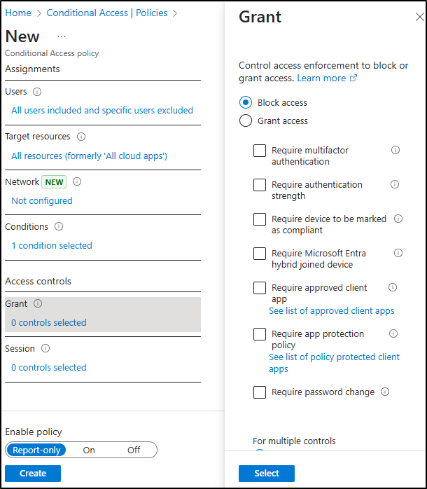

---
lab:
  title: 练习 2 - 实现自适应保护
  module: Module 3 - Implement Insider Risk Management
---

# 实验室 3 - 练习 2 - 实现自适应保护

你是 Contoso Ltd 的信息安全管理员 Joni Sherman。你的角色涉及保护敏感数据并响应内部风险。 为了增强保护，你将启用 Microsoft Purview 自适应保护，该保护会根据内部风险级别动态调整数据丢失防护 (DLP) 强制措施。

**任务**：

1. 将内部风险策略分配到自适应保护
1. 为 DLP 策略配置自适应保护设置
1. （可选）使用自适应保护配置条件访问
1. 启用自适应保护

## 任务 1 – 将内部风险策略分配给自适应保护

1. 使用 **SC-401-cl1\admin** 帐户登录到客户端 1 VM (SC-401-CL1)。

1. 在 **Microsoft Edge** 中，导航到 **`https://purview.microsoft.com`**，并以 **Joni Sherman** 的身份 `JoniS@WWLxZZZZZZ.onmicrosoft.com`（其中 ZZZZZZ 是实验室托管提供程序提供的唯一租户 ID）登录。

1. 在 Microsoft Purview 门户中，导航到“**解决方案**” > “**内部风险管理**” > “**自适应保护**”。

1. 从左侧导航窗格中，选择“**内部风险级别**”。

1. 在“**内部风险级别**”页上：

   - 在“内部风险策略”下拉列表中，选择在上一练习中创建的“**数据泄漏快速策略**”。
   - 保留所有默认风险级别设置不变。
   - 选择“保存”。

已将内部风险策略链接到自适应保护，从而跨 Microsoft Purview 启用基于风险的动态操作。

## 任务 2 - 为 DLP 策略配置自适应保护设置

现在，自适应保护已链接到内部风险策略，你将更新 DLP 策略，以通过阻止共享敏感数据来响应提升的风险级别。

1. 在 Microsoft Purview 中，导航到“**解决方案**” > “**数据丢失防护**” > “**策略**”。

1. 在“**策略**”页上，选中上一练习中创建的“**DLP - 信用卡保护**”策略的复选框，然后选择“**编辑策略**”。

1. 在 DLP 配置中，选择“**下一步**”，直到进入“**自定义高级 DLP 规则**”页面。

1. 选择“**信用卡信息规则**”旁边的铅笔图标进行编辑。

1. 在“**编辑规则**”页上：
   - 在“**描述**”字段中，输入：`Block sharing of credit card data when user has an elevated insider risk level.`
   - 在“**条件**”部分中，选择“**添加条件**” > “**自适应保护的风险级别为**”。
   - 在新的部分中，选择“**提升的风险**”。
   - 在“**操作**”下，将“**限制访问或加密 Microsoft 365 中的内容**”设置为“**阻止所有人**”。
   - 选择“**保存**”以更新规则。

1. 返回到“自定义高级 DLP 规则”页，选择“下一步”********。

1. 在“**策略模式**”页上，使策略保持活动状态，然后选择“**下一步**”。

1. 在“**查看并完成**”页上，选择“**提交**”，然后在策略更新后，选择“**完成**”。

你已更新 DLP 策略，以在提升内部风险时阻止共享，并根据用户行为加强数据保护。

## 任务 3 – （可选） 使用自适应保护配置条件访问

要添加另一层强制措施，可以使用内部风险级别来限制使用条件访问的访问。 在此任务中，你将创建一个策略，用于阻止具有提升内部风险级别的用户访问。

1. 在 Microsoft Purview 中，退出登录 Joni 的帐户并关闭所有浏览器窗口。

1. 打开新的 Microsoft Edge 窗口，导航到 **Microsoft Entra 管理中心** (`https://entra.microsoft.com`) 以 **MOD 管理员** `admin@WWLxZZZZZZ.onmicrosoft.com`（其中 ZZZZZZ 是实验室托管提供程序提供的唯一租户 ID）的身份登录。 管理员密码应由实验室托管提供程序提供。

1. 在“**需要更多信息**”上，选择“**下一步**”。

1. 在“**保持帐户安全**”页上，按照提示使用 Microsoft Authenticator 或其他身份验证应用设置多重身份验证（MFA）。

   完成 MFA 设置后，你将转到 **Microsoft Entra 管理中心**。

1. 在“Microsoft Entra 管理中心”内，导航到“**保护**” > “**条件访问**” > “**策略**”。

1. 在“**策略**”页上，选择“**+ 新建策略**”。

1. 在“**新建策略**”页上，将策略命名为：`Block all access for elevated risk`。

1. 在“**分配**”下，配置“**用户**”部分：

   - **包含**：所有用户  
   - **排除**：`Joni Sherman` 和 `MOD Administrator`

     

1. 在“**目标资源**”下，确认下拉列表设置为“**资源 (以前为云应用)**”，然后选择“**所有资源(以前为‘所有云应用’)**”。

     

1. 在“**条件**”下，选择“**内部风险**”。 将“**配置**”设置为“**是**”，然后将风险级别设置为“**提升**”。

     

1. 在“访问控制”下，选择“授予”********。 选择“**阻止访问**”，然后选择浮出控件底部的“**选择**”。

     

1. 在页面底部，确认将“**启用策略**”设置为“**仅限报告**”，然后选择“**创建**”。

1. 返回条件访问的“**策略**”页，选择“**刷新**”以验证新创建的策略是否显示。

1. 选择窗口右上角的 MA 图标，然后选择“**退出登录**”，以退出 MOD 管理员帐户，并关闭所有浏览器窗口。

你已创建一个条件访问策略，该策略阻止对提升风险用户的访问，而不会影响立即访问，因为该策略处于仅报告模式。

## 任务 4 – 启用自适应保护

在此最终任务中，你将打开自适应保护，以便系统可以根据内部风险开始应用动态强制措施。

1. 打开 **Microsoft Edge**，导航到 **`https://purview.microsoft.com`**，并以 **Joni Sherman** 的身份 `JoniS@WWLxZZZZZZ.onmicrosoft.com`（其中 ZZZZZZ 是实验室托管提供程序提供的唯一租户 ID）登录。

1. 导航到“**解决方案**” > “**内部风险管理**” > “**自适应保护**”。

1. 确认配置：

   - 在“**内部风险级别**”选项卡上，选择了“**数据泄漏快速策略**”。

   - 在“**条件访问**”选项卡上，“**阻止所有较高的风险访问**”策略可见（可选）。

   - 在“**数据丢失防护**”选项卡上，列出了“**DLP - 信用卡保护策略**”。

1. 选择“**自适应保护设置**”选项卡。

1. 将“**自适应保护**”切换到“**打开**”，然后选择“**保存**”。

你已成功启用“自适应保护”。 强制操作现在将根据用户的预览体验成员风险级别自动调整。
