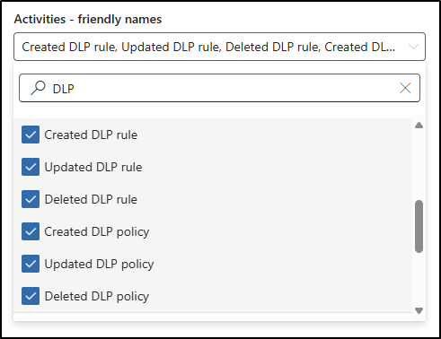

---
lab:
  title: 练习 1 - 搜索审核日志
  module: Module 6 - Audit and search activity in Microsoft Purview
---

## WWL 租户 - 使用条款

如果在讲师引导式培训过程中向你提供租户，请注意，提供租户旨在支持讲师引导式培训中的动手实验室。

租户不应共享或用于动手实验室以外的用途。 本课程使用的租户为试用租户，课程结束后无法使用或访问，不符合扩展条件。

租户不得转换为付费订阅。 在本课程中获得的租户仍然是 Microsoft Corporation 的财产，我们保留随时获取访问权限和收回的权利。

# 实验室 6 - 练习 1 - 搜索审核日志

你是 Contoso Ltd 的信息安全管理员 Joni Sherman。作为加强组织调查和合规性准备的一部分，你被要求使用 Microsoft Purview 审核来评审 DLP 配置更改，并确保将敏感活动的审核记录保留很长时间。 你将搜索与 DLP 策略相关的审核事件、导出脱机分析的结果，并配置审核保留策略，以跨 Exchange、SharePoint 和终结点活动保留关键记录。

**任务**：

1. 搜索 DLP 相关的活动
1. 导出审核日志搜索结果
1. 创建审核日志保留策略

## 任务 1 - 搜索与 DLP 相关的活动

在此任务中，你将使用 Microsoft Purview 审核解决方案搜索与 DLP 策略和规则相关的最新审核事件。

1. 在 Microsoft Edge 中，导航到 `https://purview.microsoft.com` 并以 **Joni Sherman** 的身份 `JoniS@WWLxZZZZZZ.onmicrosoft.com` （其中 ZZZZZZ 是实验室托管提供程序提供的唯一租户 ID）登录到 Microsoft Purview 门户。 Joni 的密码是在上一练习中设置的。

1. 在 Microsoft Purview 中，导航到“**解决方案**” > “**审核**”。

1. 在“**搜索**”页上，配置搜索：

   - **日期和时间范围 (UTC)**：

     - **开始日期**：3 天前
     - **结束日期**：今天

   - **活动 - 友好名称**：在**信息保护和 DLP 活动**下搜索 `DLP` 并选择以下活动：

     - 已创建 DLP 规则
     - 已更新 DLP 规则
     - 已删除 DLP 规则
     - 已创建 DLP 策略
     - 已更新 DLP 策略
     - 已删除 DLP 策略

   

   - **搜索名称**：`DLP Policy Activity`

1. 选择“搜索”****。

1. 完成搜索可能需要几分钟时间。 审核处理搜索时，刷新页面以检查“**作业状态**”、**“进度”(%)** 和“**搜索时间**”。

1. 完成后，选择“**DLP 策略活动**”以查看结果。

1. 选择单个结果以查看有关每个 DLP 活动的详细信息。

你已搜索并查看了与 DLP 策略和规则配置相关的审核活动。

## 任务 2 - 导出审核搜索结果

在此任务中，你将导出 DLP 审核搜索结果，以便进行脱机分析或合规性记录保留。

1. 在 Microsoft Purview 中，导航到“**解决方案**” > “**审核**”。

1. 在“**搜索**”页上，选择在上一任务中创建的“**DLP 策略活动**”搜索。

1. 选择页面顶部的“导出”****。

1. 在确认对话框中，选择“**确定**”以启动导出。

1. 导出完成后，选择绿色“**导出完成**”横幅中的“**下载文件**”链接。

 > [!Note] **备注**：审核导出文件以 CSV 格式保存，可在任何文本编辑器或电子表格应用程序中打开。 为便于审阅，请使用 Excel 或其他电子表格工具。 在此实验室环境中，可以在记事本中打开 CSV 以确认导出成功完成。

你导出了与 DLP 相关的审核日志，这些日志可用于脱机评审或记录保留。

## 任务 3 - 创建审核保留策略

在此任务中，你将配置审核保留策略，以保留与 DLP 匹配项和操作相关的日志以供长期调查。

1. 在 Microsoft Purview 中，导航到“**解决方案**” > “**审核**”。

1. 从左侧边栏中选择“**策略**”。

1. 在“**策略**”页上，选择“**新建审核保留策略**”

1. 在“**新建审核保留策略**”面板中，输入：

   - **策略名称**：`Retain DLP Audit Logs`
   - **说明**：`Retains audit logs for DLP activities across Exchange, SharePoint, and endpoints to support investigation and compliance.`
   - **用户**：留空以应用于所有用户
   - **记录类型**：
      - ComplianceDLPEndpoint
      - ComplianceDLPExchange
      - ComplianceDLPExchangeClassification
      - ComplianceDLPSharePoint
      - ComplianceDLPSharePointClassification
   - **持续时间**：1 年
   - **优先级**：`1`

1. 选择“**保存**”以创建审核保留策略。

你已配置审核保留策略，该策略将 DLP 匹配项和活动日志保留一年。
