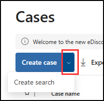
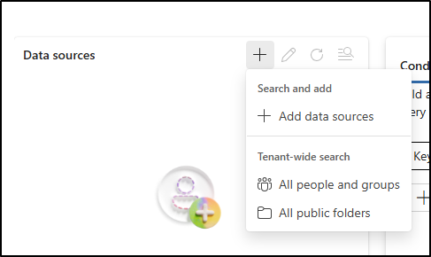
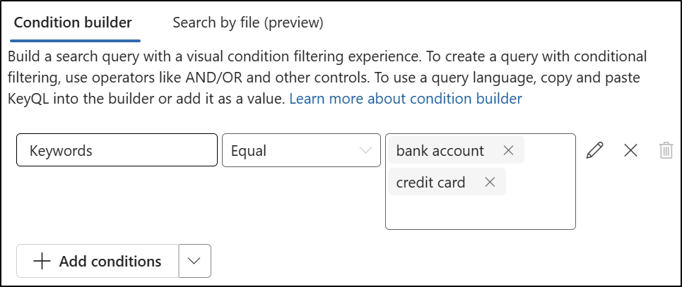

---
lab:
  title: 练习 2 - 执行内容搜索
  module: Module 6 - Audit and search activity in Microsoft Purview
---

## WWL 租户 - 使用条款

如果在讲师引导式培训过程中向你提供租户，请注意，提供租户旨在支持讲师引导式培训中的动手实验室。

租户不应共享或用于动手实验室以外的用途。 本课程使用的租户为试用租户，课程结束后无法使用或访问，不符合扩展条件。

租户不得转换为付费订阅。 在本课程中获得的租户仍然是 Microsoft Corporation 的财产，我们保留随时获取访问权限和收回的权利。

# 实验室 6 - 练习 2 - 执行内容搜索

你是 Contoso Ltd 的信息安全管理员 Joni Sherman。组织收到了一条警报，指出敏感的财务数据可能已公开。 你被要求使用 Microsoft Purview 搜索包含跨 Microsoft 365 服务的主要财务术语的内容。 你的目标是确定是否不恰当地共享了任何敏感内容，并支持调查。

**任务**：

1. 分配电子数据展示权限
1. 使用敏感财务术语搜索内容

## 任务 1 - 分配电子数据展示权限

在此任务中，你将向 Joni Sherman 分配电子数据展示权限，以便她可以在 Microsoft Purview 中执行内容搜索。

1. 使用 **SC-401-CL1\admin** 帐户登录到客户端 1 VM (SC-401-CL1)。

1. 如果你仍以 Joni 的身份登录，请退出此帐户并关闭所有浏览器窗口。

1. 在 Microsoft Edge 中，导航到 `https://purview.microsoft.com` 并以 MOD 管理员的身份 `admin@WWLxZZZZZZ.onmicrosoft.com` （其中 ZZZZZZ 是实验室托管提供程序提供的唯一租户 ID）登录到 Microsoft Purview 门户  。 管理员的密码应由实验室托管提供程序提供。

1. 在左侧边栏上，选择“**设置**” > “**角色和范围**” > “**角色组**”。

1. 在“**Microsoft Purview 解决方案的角色组**”页上，搜索 `eDiscovery`，然后选择“**电子数据展示管理员**”。

1. 在“**电子数据展示管理员**”浮出控件面板上，选择“**编辑**”。

1. 在“管理电子数据展示管理员”页上，选择“选择用户”。

1. 在“**选择用户**”浮出控件页面上，搜索 `Joni`，然后选择 **Joni Sherman** 的复选框。 选择面板底部的“**选择**”按钮。

1. 回到“**管理电子数据展示管理员**”页上，选择“**下一步**”。

1. 在“管理电子数据展示管理员”页上，选择“下一步”。

1. 在“**查看角色组并完成**”页上，选择“**保存**”。

1. 在“**已成功更新角色组**”页上，选择“**完成**”。

1. 选择窗口右上角的 **MA** 图标，然后选择“**退出登录**”，以退出 MOD 管理员帐户。

你已将电子数据展示权限分配给 Joni Sherman，使她能够在调查过程中搜索敏感内容。

## 任务 2 - 使用敏感财务术语搜索内容

1. 在 Microsoft Edge 中，导航到 `https://purview.microsoft.com` 并以 **Joni Sherman** 的身份 `JoniS@WWLxZZZZZZ.onmicrosoft.com` （其中 ZZZZZZ 是实验室托管提供程序提供的唯一租户 ID）登录到 Microsoft Purview 门户。 Joni 的密码是在上一练习中设置的。

1. 在 Microsoft Purview 中，导航到“**解决方案**” > “**电子数据展示**”。

1. 在“**案例**”页上，选择“**创建案例**”旁边的下拉列表，然后选择“**创建搜索**”。

   

1. 在“**输入详细信息以开始**”对话框中，输入：

   - **大小写名称**：`Financial Data Exposure Review`
   - **搜索名称**：`Financial Data Leak Investigation`
   - **案例说明**：`Case opened to support security investigation efforts by identifying potential exposure of sensitive financial terms in Microsoft 365 content.`
   - **搜索说明**：`Search targets common high-risk financial keywords to support data security monitoring and policy validation.`

1. 选择“**创建**”以创建搜索。

1. 在“**财务数据泄漏调查**”页上，在“**数据源**”下选择“**+**”（加号）>“**添加数据源**”。

   

1. 在“**搜索源**”浮出控件中，选择“**财务团队**”组，然后选择“**保存并关闭**”。

1. 在“**条件生成器**”窗格中，添加关键字 `bank account` 和 `credit card`，然后选择“**运行查询**”。

   

1. 在“**统计信息**”下的“**选择搜索结果**”浮出控件中，选中“**包含类别**”和“**包含查询关键字报表**”的复选框，然后选择“**运行查询**”。

1. 查看搜索的结果：

   - 选择“**统计信息**”选项卡以查看搜索指标的摘要。
   - 选择“**示例**”选项卡以预览匹配的内容。

你已执行基于关键字的内容搜索，以帮助确定敏感财务数据是否不恰当地共享。 这些结果支持安全调查，并帮助指导风险响应。
