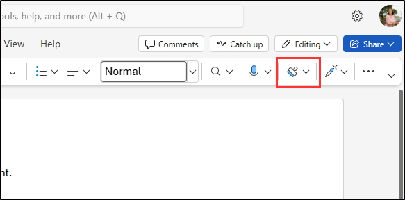
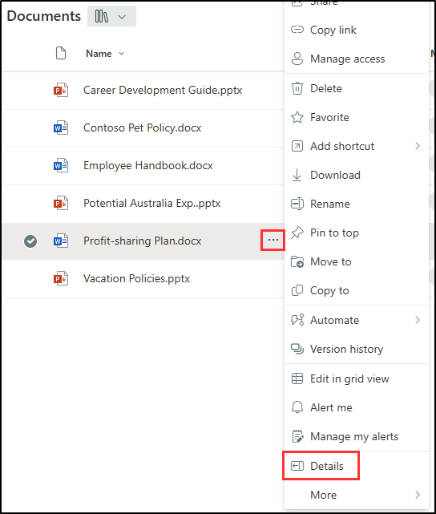
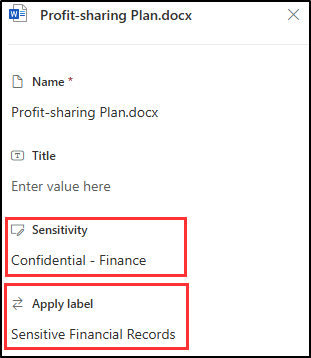

---
lab:
  title: 验证敏感度、DLP 和保留策略
  module: 'Policy validation - Validate sensitivity, DLP, and retention policies'
---

## WWL 租户 - 使用条款

如果在讲师引导式培训过程中向你提供租户，请注意，提供租户旨在支持讲师引导式培训中的动手实验室。

租户不应共享或用于动手实验室以外的用途。 本课程使用的租户为试用租户，课程结束后无法使用或访问，不符合扩展条件。

租户不得转换为付费订阅。 在本课程中获得的租户仍然是 Microsoft Corporation 的财产，我们保留随时获取访问权限和收回的权利。

# 验证实验室 - 验证敏感度、DLP 和保留策略

你是 Contoso Ltd 的信息安全管理员 Joni Sherman。配置敏感度标签、数据丢失防护 (DLP) 和保留策略后，你被要求验证这些配置是否按预期工作。 在此实验室中，你将测试 Microsoft 365 应用中每个策略的行为，并验证内容是否已根据策略设置进行保护和保留。

**任务**：

1. 在 Word 中应用敏感度标签
1. 在 Outlook 中触发 DLP 策略
1. 在 SharePoint 中，应用保留和敏感度标签

## 任务 1 - 在 Word 中应用敏感度标签

在此任务中，你将验证已发布的敏感度标签是否可供用户使用，并且可以直接从 Microsoft Word 应用。

1. 你仍应使用 **SC-401-cl1\admin** 帐户登录到客户端 1 VM (SC-401-CL1)，并且应以 **Joni Sherman**`JoniS@WWLxZZZZZZ.onmicrosoft.com`（其中 ZZZZZZ 是实验室托管提供者提供的唯一租户 ID）的身份登录到 Microsoft 365。 Joni 的密码是在上一练习中设置的。

1. 在 Microsoft Edge 中，选择左上角的应用启动器，然后选择 **Word**。

    

1. 选择“**空白文档**”。

1. 如果系统提示，请关闭“**隐私选项**”对话框。

1. 在文件中输入以下文本：

   `Important HR employee document.`

1. 从导航功能区中选择“**敏感度**”，然后选择“**内部**” > “**员工数据(HR)**，将新创建的敏感度标签应用于此文档。

    

    > [!Note] 新发布的敏感度标签可能需要 24-48 小时才能可供应用。 如果新创建的敏感度标签不可用，则可以使用此练习的“**机密**” > “**所有员工**”。

1. 将敏感度标签更改为“**公开**”，以验证显示业务理由对话框。

1. 选择“**取消**”，以保留敏感度标签。

1. 在文档的左上角，选择“**文档**”以重命名此文件，并将其重命名为 **`HR Document`**。 按 Enter 应用此名称更改。

    

你已验证 HR 敏感度标签是否可用，并将相应的保护应用于 Word 文档。

## 任务 2 - 在 Outlook 中触发 DLP 策略

接下来，你将在电子邮件中发送敏感的员工信息，以验证 DLP 策略是否正确检测并阻止活动。

1. 你应仍使用 **SC-401-CL1\admin** 帐户登录到客户端 1 VM (SC-401-CL1)，并以 Joni Sherman 的身份登录到 Microsoft 365。

1. 在 Microsoft Edge 中，选择左上角的应用启动器，然后选择 **Outlook**。

1. 选择左上角的“新建邮件”按钮以撰写新电子邮件****。

1. 在“**收件人**”字段中，输入 `Megan`，然后选择 **Megan Bowen** 的电子邮件地址。

1. 在主题字段中，输入 `Help with employee information`。

1. 在电子邮件正文中输入：

   ``` text
   Please help me with the start dates for the following employees:
   ABC123456
   DEF678901
   GHI234567

   Thank you, 
   Joni Sherman
   ```

1. 选择邮件窗口右上角的“发送”按钮以发送电子邮件****。

1. 你应该会收到一条消息，指出电子邮件无法送达并被 DLP 策略阻止。

   

已确认 DLP 策略阻止通过电子邮件传输敏感员工 ID。

## 任务 3 - 在 SharePoint 中应用保留和敏感度标签

要测试保留配置，请将保留标签应用于存储在 SharePoint 中的文档，并验证敏感度标签是否也可用。

1. 你应仍使用 **SC-401-CL1\admin** 帐户登录到客户端 1 VM (SC-401-CL1)，并以 Joni Sherman 的身份登录到 Microsoft 365。

1. 在 Microsoft Edge 中，选择左上角的应用启动器，然后选择 **SharePoint**。

1. 在 SharePoint 登陆页面上，搜索“`Benefits`”，然后从搜索结果中选择“**Benefits @ Contoso**”。

1. 在左侧窗格中，选择“**文档**”。

1. 在“**文档**”页上，选择 **Profit-sharing Plan.docx** 旁边的省略号，然后选择“**详细信息**”。

   

1. 在“**详细信息**”面板中，更新以下字段：
   - **机密性**：机密 - 财务
   - **应用标签**：敏感财务记录

     

你已确认保留标签和敏感度标签可用，可应用于 SharePoint 文档。
